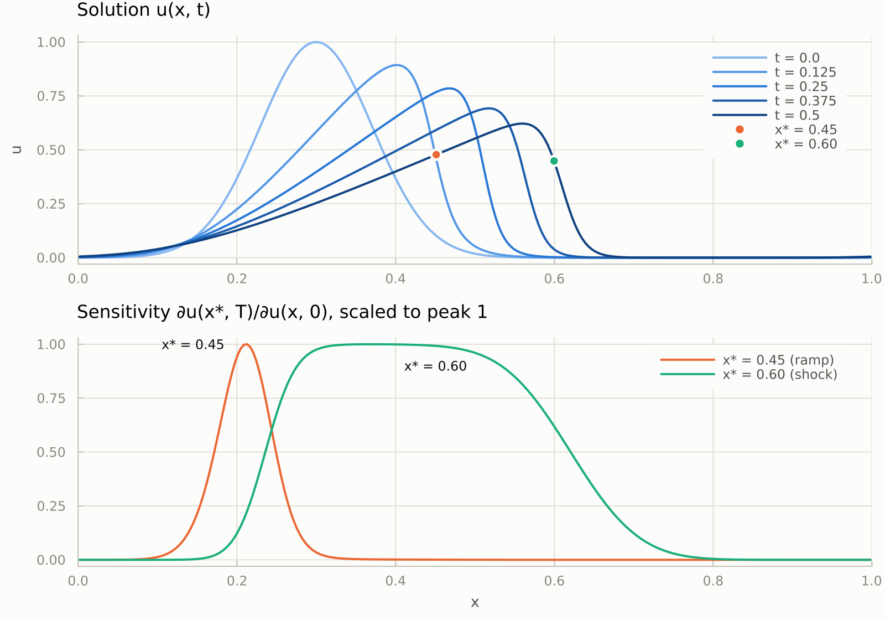

# Checkpointing 
[](https://github.com/Argonne-National-Laboratory/Checkpointing.jl/actions/workflows/action.yml)
[![][docs-stable-img]][docs-stable-url] 
[](https://doi.org/10.5281/zenodo.5920962)

This package provides checkpointing schemes for adjoint computations using automatic differentiation (AD) of time-stepping loops. Currently, we support the macro `@ad_checkpoint`, which differentiates and checkpoints a mutable struct used in a while or for loop with a `UnitRange`.

Each loop iteration is differentiated using [Enzyme.jl](https://github.com/EnzymeAD/Enzyme.jl). We rely on external differentiation rule systems to integrate with AD tools applied to the code outside of the loop.

The schemes are agnostic to the AD tool being used and can be easily interfaced with any Julia AD tool. Currently, the package supports:

## Scheme
* Revolve/Binomial checkpointing [1]
* Periodic checkpointing
* Online r=2 checkpointing for while loops with a priori unknown number of iterations [2]

## Rules
* [EnzymeRules.jl](https://enzyme.mit.edu/julia/stable/generated/custom_rule/)

## Storage
* ArrayStorage: Stores all checkpoints values in an array of type `Array`
* HDF5Storage: Stores all checkpoints values in an HDF5 file (requires `using HDF5`; provided by a package extension)

## GPU
Checkpoints of GPU arrays (`CuArray`, `ROCArray`, ...) stay on the device and are
refilled in place, with no GPU dependency in the package. See
`examples/heat_gpu.jl` and the GPU page of the documentation for how to write a
loop body Enzyme can differentiate on a device.

## Installation

```julia
] add Checkpointing
```

## Related packages
* [TreeverseAlgorithm.jl](https://github.com/GiggleLiu/TreeverseAlgorithm.jl): Visualization of the Revolve algorithm
* [Burgers.jl](https://github.com/DJ4Earth/Burgers.jl): A showcase of checkpointing applied to an MPI parallelized 2D Burgers equation solver

## Usage: Example 1D Burgers equation

The viscous Burgers equation `u_t + (u²/2)_x = ν u_xx` is nonlinear, so the adjoint of each time step depends on the state at that step. A reverse pass therefore needs every forward state, and storing them all takes memory proportional to the number of time steps. Checkpointing stores a few of them and recomputes the rest.

We start from a Gaussian bump on the periodic unit interval. Its crest travels fastest, so the front steepens into a shock. The time loop is wrapped in `@ad_checkpoint`, and `Revolve(10)` keeps 10 of the 500 states, recomputing the others during the reverse pass.

```julia
# Viscous Burgers equation u_t + (u²/2)_x = ν u_xx on the periodic unit interval.
# The crest of a Gaussian bump travels fastest, so the wave steepens into a shock.
using Checkpointing
using Enzyme

mutable struct Burgers
    u::Vector{Float64}      # state at the current time step
    ulast::Vector{Float64}  # state at the previous time step
    ν::Float64              # viscosity
    Δx::Float64
    Δt::Float64
end

Burgers(u0; ν = 0.005, Δt = 1e-3) = Burgers(copy(u0), similar(u0), ν, 1 / length(u0), Δt)

# One explicit Euler step, central differences, periodic boundaries.
function step!(b::Burgers)
    b.ulast .= b.u
    u, n = b.ulast, length(b.u)
    for i = 1:n
        l = i == 1 ? n : i - 1
        r = i == n ? 1 : i + 1
        flux = (u[r]^2 - u[l]^2) / (4 * b.Δx)
        diffusion = b.ν * (u[r] - 2 * u[i] + u[l]) / b.Δx^2
        b.u[i] = u[i] + b.Δt * (diffusion - flux)
    end
    return nothing
end

# u(x_k, T) after `steps` time steps.
function probe(b::Burgers, scheme::Scheme, steps::Int, k::Int)
    @ad_checkpoint scheme for i = 1:steps
        step!(b)
    end
    return b.u[k]
end

# The gradient of u(x_k, T) with respect to the initial condition u(x, 0).
function sensitivity(u0::Vector{Float64}, scheme::Scheme, steps::Int, k::Int)
    b = Burgers(u0)
    db = Enzyme.make_zero(b)
    autodiff(Reverse, probe, Duplicated(b, db), Const(scheme), Const(steps), Const(k))
    return db.u
end

n = 256
x = ((1:n) .- 0.5) ./ n
u0 = exp.(-((x .- 0.3) ./ 0.1) .^ 2)
k = argmin(abs.(x .- 0.6))                  # probe the shock at x* = 0.6
du0 = sensitivity(u0, Revolve(10), 500, k)  # T = 500 * Δt = 0.5
```

<picture>
  <source media="(prefers-color-scheme: dark)" srcset="docs/src/assets/burgers-dark.png">
  
</picture>

One reverse pass gives the gradient of `u(x*, T)` with respect to the whole initial condition. A point on the smooth ramp behind the crest (x* = 0.45) depends only on a narrow patch of the initial condition near x = 0.21, where its characteristic starts. A point in the shock (x* = 0.60) depends almost equally on everything between x = 0.3 and x = 0.6: all of that fluid has run into the shock, and the shock's position depends on how much of it there was. Its total sensitivity is almost 30 times larger.

The code is in `examples/burgers.jl`, and `examples/burgers_plots.jl` draws the figure.

[1] Andreas Griewank and Andrea Walther, Algorithm 799: Revolve: An Implementation of Checkpointing for the Reverse or Adjoint Mode of Computational Differentiation. ACM Trans. Math. Softw. 26, 1 (March 2000), 19–45. DOI: [10.1145/347837.347846](https://doi.org/10.1145/347837.347846)

[2] Philipp Stumm and Andrea Walther, New Algorithms for Optimal Online Checkpointing, 2010, DOI: [10.1137/080742439](https://doi.org/10.1137/080742439)

## Funding

This work is supported by the NSF Cyberinfrastructure for Sustained Scientific Innovation (CSSI) program project [DJ4Earth](https://dj4earth.github.io/)

[docs-stable-img]: https://img.shields.io/badge/docs-stable-blue.svg
[docs-stable-url]: https://Argonne-National-Laboratory.github.io/Checkpointing.jl/
